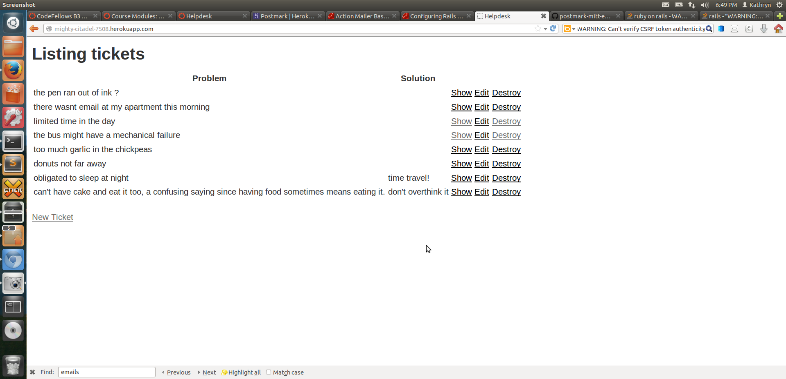

Welcome to this app for soliciting help from me! When it's deployed on Heroku, it sends email to me any time a new ticket with a problems is created. I then reply to that email, and the response shows up on the app.

As you can see in the screencap above, solutions have not yet been provided.
